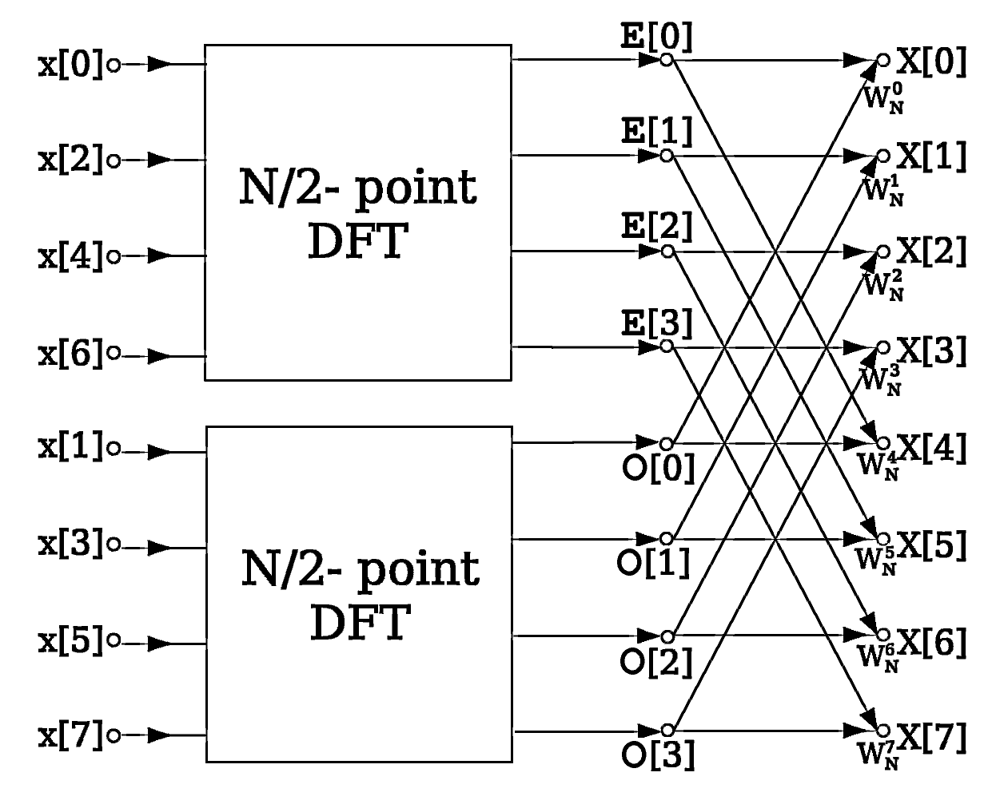

# FFT-Radix2-Pipeplined


## Explanation of Consept
Simple implementation of fast fourier transform in Hardaware using VHDL. 


The choosen method for this is taken form [wiki](https://en.wikipedia.org/wiki/Fast_Fourier_transform) of FFT and its based on the folling images: 

  


- Radix-2 : Every level uses decomposition into half-sizes(mod 2) FFTs. Can be imagined as a binary tree. 
- Pipelined : Every stage/level stores the output into a flip-flop. This is done to lessen the critical path which is now only a addition + multiplication but before it would be logN(addition+mutliplication). The circles that this fft implementation need to produce a output is logN.
- The arithmetic which is used in the particular project is fixed point Q1.15. (this can be easily changed without affecting the other programm by changing the logic in the adder and subber modules). In every stage to be able to keep the result in fixed point Q1.15 the output is divided by 2. 
  
The hole project is parametric and its variables can be changed in package/common.vhd. The variables are: 
- input_size : Determines the amount of complex inputs in the fft (image = 8)
- input_length_size : log2(input_size)
- x_size : the lenght of real and imaginary number in the complex input


## Explanation of Implementation
The implemantation is based on 4 modules :
- scrambler
- butterfly
  - adder
  - subber

### Scrambler 
The scrambler changed the position of the inputs by changing the direction we read the bits 
For example with the inputs in the image (input_size = 8):
```
000 => 000 := 0 
001 => 100 := 4
010 => 010 := 2
011 => 110 := 6
100 => 001 := 1
101 => 101 := 5
110 => 011 := 3
111 => 111 := 7
```
### Buttefly 
The butterfly module execute this operation:

y0 = x0 + x1*twiddle

y1 = x0 - x1*twiddle

For these operations we have the adder module and the subber one accordingly.

Butterfly module can take any number of inputs 2^stage (stage=1 => 2, stage=2 => 4). The first half of the inputs perform the buttefly operation with the next half inside the butterfly based on this formula:  
```
butterfly_operation(input(i),input(i+(2^stage/2)))
```
To add the twiddle factors we use this logic: 
```
#twiddle_factors*Σ(Α=0 to Α=stage-1) Α/#butterfly_inputs
```

so the above formula transforms: 
```
butterfly_operation(input(i),input(i+(2^stage/2)),twiddle_factors*Σ(Α=0 to Α=stage-1) Α/#butterfly_inputs)
```

In each level we have the amount of butterfly modules in order to perform all operation. 
Here, is an image of the rtl design of input_size = 8:

 
### Adder 
This module performs the first part of operation of the butterfly. 

y0 = x0 + x1*twiddle

We have complex numbers with the arithmetic fixed point Q1.15. The function we have to do is:
```
(1.re + 1.im) + (2.re + 2.im)*(3.re + 3.im)
re => 1.re + 2.re*3.re - 2.im*3.im
im => 1.im + 2.re*3.im + 2.im*3.re
```
### Subber 
This module performs the second part of operation of the butterfly. 

y0 = x0 - x1*twiddle

We have complex numbers with the arithmetic fixed point Q1.15. The function we have to do is:

```
(1.re + 1.im) - (2.re + 2.im)*(3.re + 3.im)
re =>1.re - 2.re*3.re + 2.im*3.im
im =>1.im - 2.re*3.im - 2.im*3.re
```
## Explanation of Use

To use it, go to testbench/fft_tb.vhd change the inputs according to your prefered input_size. 

To test the output, fftpython/fft.py excecutes the fft. 
Here are an image of the testbench and the python output with input_size = 8 (remember because we use fixed_point Q1.15 => [-1,1) we may have some approximation issues):

  
